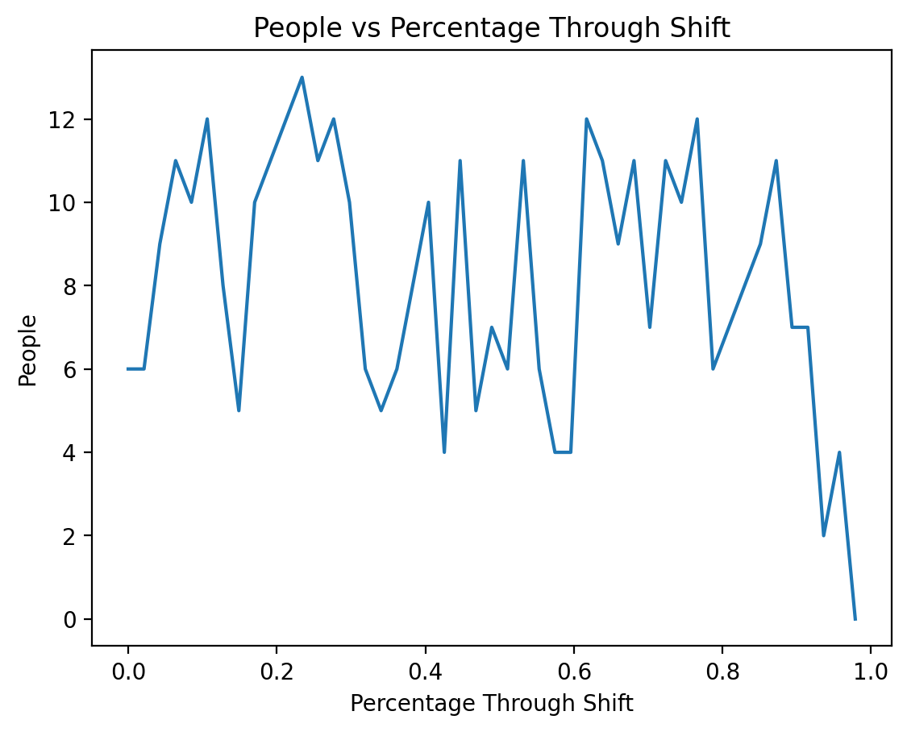

# Introduction
I initially tried using DETR to count the number of planes in an image, my intention was to use that as a proxy for how busy a given airport was, but that failed hilariously (see below). I figured I would need to pick more in distribution images to get reasonably good results, so instead I decided to count the number of people in a bar. I chose this because it would be a simple and nifty application for tracking popularity/activity of a bar overtime and could be used to compare with other bars. It would be simple enough to set up a camera in the bar (given permission) or outside facing the door.

The failure case where DETR detects 7 cars, 1 airplane, and 1 person 1.

Below is an example from my initial testing where it misses one person (incorrectly counting two people as one).

# Method
I found a timelapse video of a bar from open to close. The video is compressed to 4 minutes, and I sampled one frame from the video every 5 seconds. I ran each of these images through DETR and recorded the number of people detected in each image.

Here are a few images from the timelapse video, showing the predicted classes along with their bounding boxes.

Here is the link to the timelapse video I used https://www.youtube.com/watch?v=lmFVWvTobOw.
# Results
The x-axis of this plot is measured from 0 to 1, 0 being when the bar opened and 1 when it closed, because the video didn't give any information about the actual time.

# Analysis of Results
Because the video I used is a timelapse of a single bar it is unreasonable to make any generalizations, and further there is no designation about when the bar opens or closes. But the bar maintains a reasonably steady average of people until close to closing time, when it dies out. The plot shows a consistant average for the majority of the time, but there is a large variance between frames. After examining the video I think this is primarily a symptom of downsampling the timelapse, rather than the true fluctuation of customers. I found nothing surprising about these results.

# Analysis of Vision Algorithms
Like most computer vision deep learning algorithms, they very rarely work 'in the wild' without any finetuning. I ran a handful of images through DETR and got reasonably accurate results, but the number of detections and correct classifications was rarely perfect. I've noticed the large gap between benchmark accuracy and real world performance frequently with my work, and I think it primarily stems from the type of data these networks are typically trained and evaluated on. The images are typically prestine quality, with a clear distinction between target, foreground, and background, which makes the learning simple and leads to non-robust representations. When doing a breif prior analysis, I found that DETR seemed to perform substantially worse on people of color (not surprising), the bar video I found is primarily of white people, so this shouldn't have much of an impact on the results I was able to gather.
